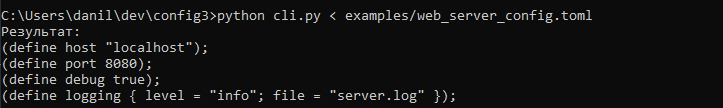
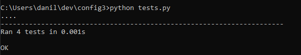

# Инструмент для преобразования TOML в пользовательский конфигурационный язык

## Описание проекта

Этот инструмент был разработан для преобразования конфигурационных файлов в формате TOML в пользовательский конфигурационный язык. 

### Задача разработки:
1. Принимать файл TOML через стандартный ввод.
2. Преобразовывать его содержимое в пользовательский конфигурационный язык:
   - Поддержка однострочных и многострочных комментариев.
   - Работа с массивами, словарями, строками и числами.
   - Поддержка объявления и вычисления констант.
3. Обрабатывать синтаксические ошибки и выводить их описание.
4. Покрыть все конструкции тестами.

### Пример содержания TOML-файла:
```toml
host = "localhost"
port = 8080
debug = true

[database]
user = "admin"
password = "secret"
```
### Скриншоты 


